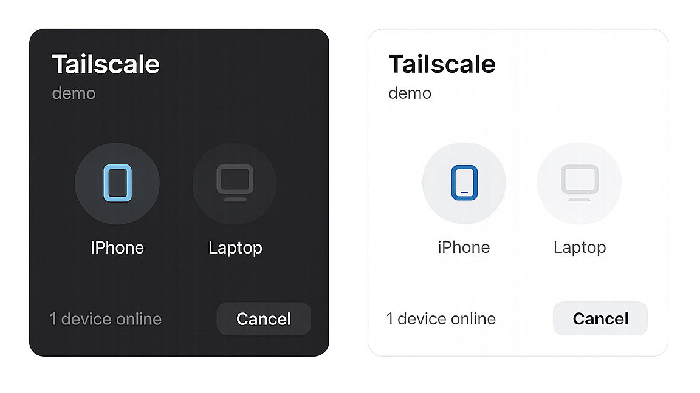

# Nautilus Tailscale

A lightweight Tailscale integration for GNOME Nautilus.

Send files to any device in your tailnet directly from Nautilus using a native right-click menu entry.



## Features

- **Top-level Nautilus Integration**
  - Right-click one or more files and select **Send with Tailscale** directly from the context menu.
- **Modern GTK4 UI**
  - Native GTK4 + Libadwaita device picker matching GNOME styling and accent colors.
- **Automatic Device Discovery**
  - Lists online and offline Tailnet devices using `tailscale status --json`.
- **Auto Receive Service**
  - Background systemd user service automatically saves incoming files into `~/Downloads/Tailscale`.
- **Desktop Notifications**
  - Native notifications for incoming and outgoing transfers.
- **Multiple File Support**
  - Send one or many files in a single operation.

## Requirements

- GNOME Nautilus
- Active Tailscale installation
- Logged into a Tailnet
- Python 3.10+
- GTK4
- Libadwaita
- Nautilus Python extension support

## Required Packages

### Fedora

```bash
sudo dnf install \
    python3-gobject \
    python3-nautilus \
    gtk4 \
    libadwaita
```

### Ubuntu / Debian

```bash
sudo apt install \
    python3-gi \
    python3-nautilus \
    gir1.2-gtk-4.0 \
    gir1.2-adw-1
```

Install and authenticate Tailscale separately:

```bash
curl -fsSL https://tailscale.com/install.sh | sh
sudo tailscale up
```

See the official Tailscale documentation for additional installation methods.

## Installation

```bash
git clone https://github.com/nextzakir/nautilus-tailscale.git
cd nautilus-tailscale

chmod +x install.sh
./install.sh
```

The installer will:

- install the sender application into:

```text
~/.local/bin/
```

- install the Nautilus extension into:

```text
~/.local/share/nautilus-python/extensions/
```

- install and enable the auto receive systemd user service

- restart Nautilus so the menu entry becomes available immediately

## Usage

Select one or more files in Nautilus.

Right click:

```text
Send with Tailscale
```

Choose the destination device from the popup window.

The selected files will be transferred using Tailscale.

Incoming files automatically appear in:

```text
~/Downloads/Tailscale
```

## Context Menu Behavior

The menu entry appears only for regular files.

| Selection Type | Visible |
|---------------|---------|
| Single file | ✅ |
| Multiple files | ✅ |
| Folder | ❌ |
| Multiple folders | ❌ |
| Mixed files and folders | ❌ |
| Background menu | ❌ |

## Project Structure

```text
tailscale_sender.py
tailscale_auto_receive.sh
tailscale-auto-receive.service
nautilus_tailscale.py
install.sh
uninstall.sh
test_tailscale.py
screenshot.png
```

### Components

#### `tailscale_sender.py`

Standalone GTK4/Libadwaita application responsible for:

- device discovery
- device selection
- file transfer execution
- transfer notifications

#### `nautilus_tailscale.py`

Nautilus Python extension responsible for:

- adding the top-level context menu entry
- collecting selected file paths
- launching the sender application

#### `tailscale_auto_receive.sh`

Background receiver loop using:

```bash
tailscale file get --wait
```

#### `tailscale-auto-receive.service`

Systemd user service managing the receiver lifecycle.

## Uninstall

```bash
chmod +x uninstall.sh
./uninstall.sh
```

This removes:

- sender application
- Nautilus extension
- auto receive script
- systemd user service

and reloads Nautilus.

## License

MIT License
